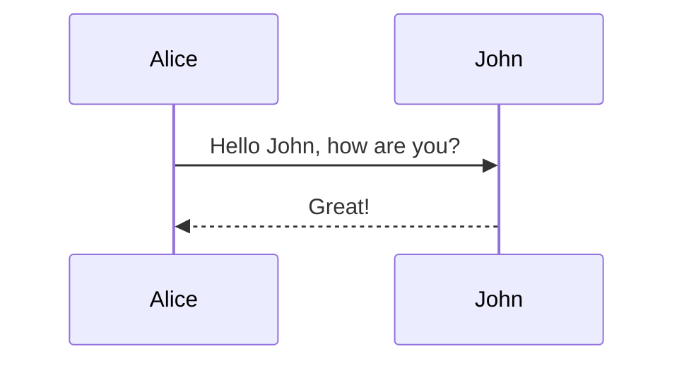
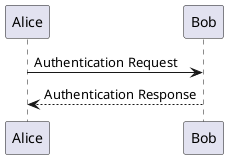

# Diagrams

Slidev supports rendering diagrams from textual descriptions using Mermaid and PlantUML.

## Mermaid

Use fenced code blocks with the `mermaid` language identifier.

```markdown

```

- **Options:** Add options in `{...}` after `mermaid`, e.g., `{scale: 0.8, theme: 'neutral'}`.
- **Syntax:** Refer to the [Mermaid documentation](https://mermaid.js.org/intro/).
- **Component:** Alternatively, use the `<Mermaid>` component.

```html
<Mermaid code="graph TD; A-->B;" :scale="0.9" />
```

## PlantUML

Use fenced code blocks with the `plantuml` language identifier. Requires a PlantUML server (defaults to `www.plantuml.com/plantuml`).

```markdown

```

- **Options:** Add options like `scale` in `{...}`.
- **Server:** Configure the PlantUML server URL in your `package.json` or `vite.config.ts` under `slidev.plantUMLServer`.
- **Syntax:** Refer to the [PlantUML documentation](https://plantuml.com/). 